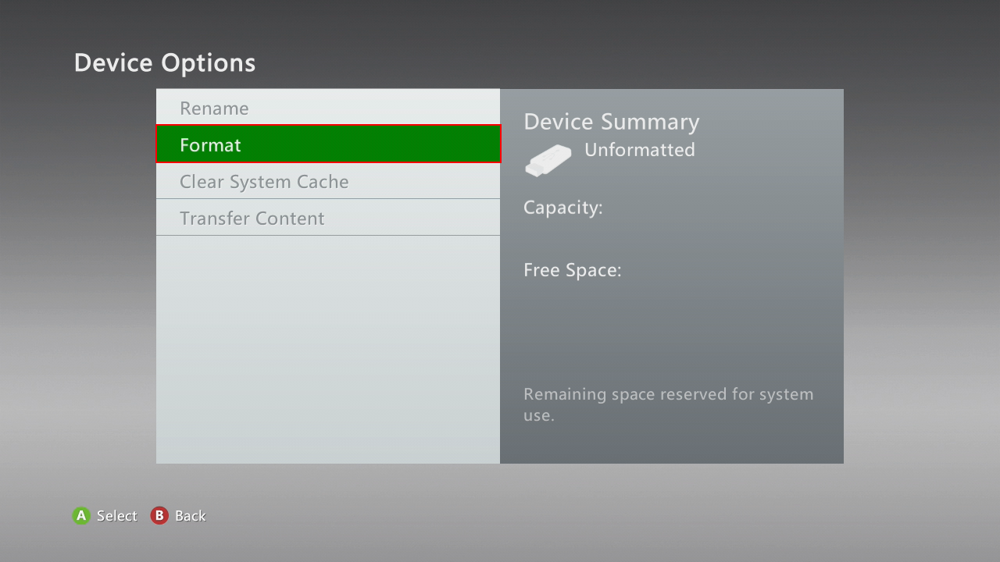
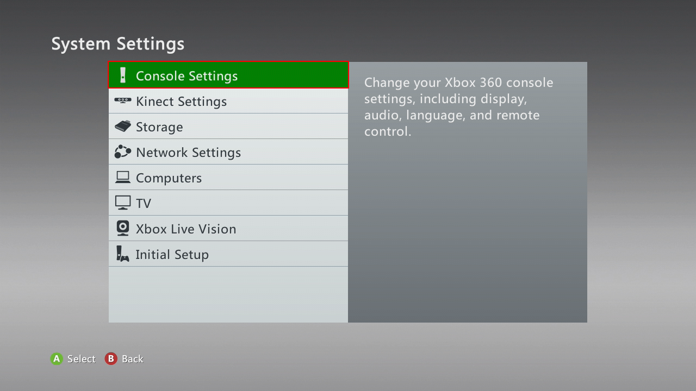
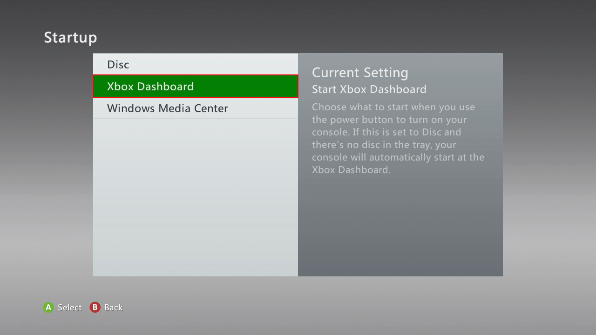

# How to Rip / Dump Games

**YOU CANNOT PLAY GAMES DIRECTLY FROM THE DISC DRIVE, OR USE AN XBOX ONE/SERIES TO RIP GAMES!**

## Stock console method

### Requirements

* Xbox 360 console
* USB storage device that's at least 16GB. You *might* encounter problems with smaller devices.
* [Velocity]

If you want to rip games from disc:

* Xbox 360 game disc
* Xbox 360 console with a working disc drive

### 0. Preparation

Before beginning, you need to check if the USB is formatted:

=== "Blades"
    1. Go to *System*.
    2. Select *Memory*.
    3. Select a device

        ??? info "If you see an unformatted storage device..."
            1. Press :xbox-a_button: to format
            2. Select *Yes*
            !!! warning "**This will erase everything from the drive. Make sure to move the files off of it first!**"
    Once done, return to home by pressing :xbox-b_button: twice.
    
=== "NXE"
    1. Go to *My Xbox > System Settings*. 
    2. Select *Memory*. 
    3. Select a device

        ??? info "If you see an unformatted storage device..."
            1. Press :xbox-a_button: to format
            2. Select *Yes*
            !!! warning "**This will erase everything from the drive. Make sure to move the files off of it first!**"
    Once done, return to home by pressing :xbox-b_button: twice.

=== "Metro"
    1. Go to *Settings > System*. 
    2. Select *Storage*. 
    3. Select a device
        

        ??? info "If you see an unformatted storage device..."
            1. Press :xbox-a_button: to format 
            2. Select *Yes* 
            !!! warning "**This will erase everything from the drive. Make sure to move the files off of it first!**"
    Once done, return to home by pressing :xbox-b_button: twice.

### 1. Ripping discs

***If your game isn't a disc (XBLA, digital, etc.) [skip this section](#2-transferring-hdd-games).***

=== "Metro"
    1. Go to *Settings > System*. 
    2. Select *Storage*. 

You'll want to change these options to stop game(s) from automatically starting:
> *[Settings > System](images/MetroSystemSettings.png) > [Console Settings](images/SystemSettingsConsoleSettings.png) > [Auto-Play](images/ConsoleSettingsAutoPlay.png) > [Disable](images/AutoPlay.png)*

??? info "Settings > System:"
    

??? info "Console Settings:"
    

??? info "Auto-Play:"
    

??? info "Disable:"
    

> *[Settings > System](images/MetroSystemSettings.png) > [Console Settings](images/SystemSettingsConsoleSettings.png) > [Startup and Shutdown](images/ConsoleSettingsStartupAndShutdown.png) > [Startup](images/StartupAndShutdownStartup.png) > [Xbox Dashboard](images/StartupXboxDashboard.png)*

??? "Settings > System:"
    

??? "Console Settings:"
    

??? "Startup and Shutdown:"
    

??? info "Startup:"
    

??? info "Xbox Dashboard:"
    

1. Go to home on the dashboard
2. Insert the disc into the drive, and close the tray.
3. Once the game shows up press :xbox-x_button: (Game Details) with the game selected.
4. Press the *Install* button.
    * If you see *Delete* instead, skip to Section 2.
      * Note: Not all games have the *Install* option. List of currently known uninstallable games:
        * College Hoops 2k7
        * Minecraft
        * Pocket Bike Racers
        * Sneak King
        * Dead or Alive Xtreme 2
5. Select the storage device you want to install the game on.
6. Once it's 100% Completed press :xbox-a_button: to continue, and press :xbox-b_button: to go back to home.

### 2. Transferring HDD games

***If you ripped the game(s) directly to the USB drive, or they're already on the USB drive, you can skip this section.***

??? info "How to transfer games from the HDD or internal storage"
    === "Metro"
        1. Go to *Settings > System*. 
        2. Select *Storage*. 
        3. Select your hard drive or internal storage and Press :xbox-y_button:. (Device Options).
            
        4. Select *Transfer Content*. 
        5. Select your USB storage device. 
        6. Make sure the games your want to move are selected. 
        7. Press right, then select *Start*. 
            When it's done you can take the USB drive out of the console.

### 3. Importing games for use in Ainex

1. Insert the USB drive into your PC. Go to `Content`.
    * If the USB drive appears empty enable *[Show hidden files and folders](https://support.microsoft.com/en-us/help/14201/windows-show-hidden-files)* in Windows Explorer.
2. Go into `00000#`. There will be folders with names consisting of lots of letters and numbers. You should find the game's folder within one of them.
3. The game will have a name with a bunch of letters and numbers just like the folders, and no file extension.
    * XBLA games will be one file, GOD (disc) games will contain a file, along with a `*.data` folder with the same name.
    * *`ContentCache.pkg` is irrelevant. Ignore it.*
 4. To confirm that it is indeed a game try opening the file in Ainex.
 5. Once you've made sure the file works in Ainex you can rename, or move the folder the game is in for convenience.
      * **FOLDER ABOVE, NOT FILE or *`.DATA` FOLDER!**
      * (Optional) If the game crashes you can try extracting the game using [Velocity].
      * If the game is extracted you will need to drag `default.xex` onto Ainex.
      * Some games have multiple .xex files, so if you can't find `default.xex` or it just doesn't work, try another one.

## RGH / JTAG method

Modded consoles can use custom dashboards or other homebrew apps
to copy game files from discs to removable storage devices.

### 1. Copy Files

Use [Aurora] or [Freestyle Dash] to copy your game data from the disc to the USB drive.

When it's done, you can take the USB drive out of the console.

### 2. Importing games for use in Ainex

1. Insert the USB drive into your PC. Go to `Content`.
    * If the USB drive appears empty enable *[Show hidden files and folders](https://support.microsoft.com/en-us/help/14201/windows-show-hidden-files)* in Windows Explorer.
2. Go into `00000#`. There will be folders with names consisting of lots of letters and numbers. You should find the game's folder within one of them.
3. The game will have a name with a bunch of letters and numbers just like the folders, and no file extension.
    * XBLA games will be one file, GOD (disc) games will contain a file, along with a *.data folder with the same name.
    * *ContentCache.pkg is irrelevant. Ignore it.*
4. To confirm that it is indeed a game try opening the file in Ainex.
5. Once you've made sure the file works in Ainex you can rename, or move the folder the game is in for convenience.
    * **FOLDER ABOVE, NOT FILE or *.DATA FOLDER!**
    * (Optional) If the game crashes you can try extracting the game using [Velocity].
    * If the game is extracted you will need to drag `default.xex` onto Ainex.
    * Some games have multiple .xex files, so if you can't find `default.xex` or it just doesn't work, try another one.

## Redump Method

***Not recommended for most users.***

If you happen to own one of these specific PC DVD drives,
you may use the [Redump method][Redump]
to dump full game ISO files for archival purposes.

- SH-D163A / TS-H353A
- SH-D163B / TS-H353B
- SH-162C / TS-H352C / SD-M2012C(?)
- SH-D162D / TS-H352D

[0800](http://wiki.redump.org/index.php?title=0800)-series optical drives from the Xbox 360
can be flashed to dump XGD3 copy-protected discs from a PC.

- Phillips VAD6038 aka BenQ VAD6038
- Liteon DG-16D2S
- Samsung TS-H943

See [Redump.org][Redump] for more information.

## Continue

!!! info "See also"
    [Redump Xbox and Xbox 360 dumping guide](http://wiki.redump.org/index.php?title=Microsoft_Xbox_and_Xbox_360_Dumping_Guide)

!!! success "Next section..."
    - [Installing DLCs](install_dlc.md)
    - [Activating Licenses (DLCs and Trials)](activate_games.md)

[Aurora]:http://phoenix.xboxunity.net/downloads/Aurora%200.7b.2%20-%20Release%20Package.rar
[Freestyle Dash]:https://consolemods.org/wiki/File:TeamFSD.Freestyle3.0.775.7z
[Velocity]:https://github.com/Gualdimar/Velocity/releases/download/xex%2Biso-branch/Velocity-XEXISO.rar
[Redump]:http://wiki.redump.org/index.php?title=Microsoft_Xbox_and_Xbox_360_Dumping_Guide
