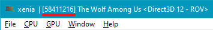
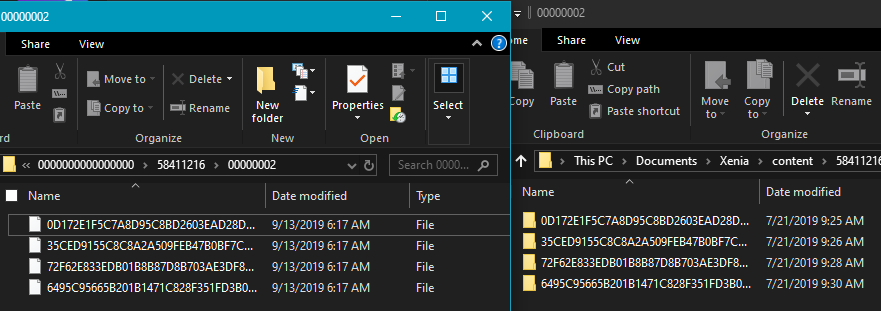

# How to install DLCs

## 0. Requirements

- Read *[Dumping games](dumping.md)*
- Download Velocity from [here][Velocity].

## 1. Extracting

1. Identify what the Game Title ID is. 
This can be identified by running the game in Ainex. 

2. Locate your DLC Content folder [from your removable storage](dumping.md).

3. Open the Packages with Velocity.

4. Extract the content packages to `Documents\Xenia\<TitleID>\00000002\<PackageHash>`. 
 

## Continue

!!! success "Next section..."
    [Activating Games and DLCs](activate_games.md)

[Velocity]:https://github.com/Gualdimar/Velocity/releases/download/xex%2Biso-branch/Velocity-XEXISO.rar
