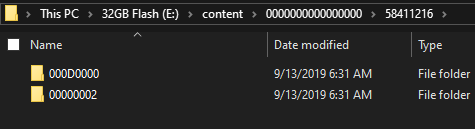
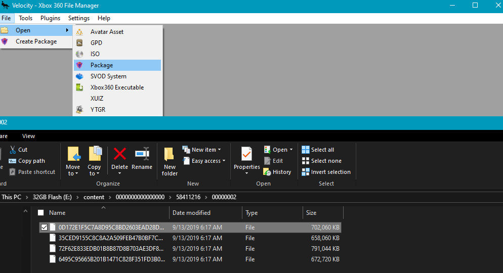
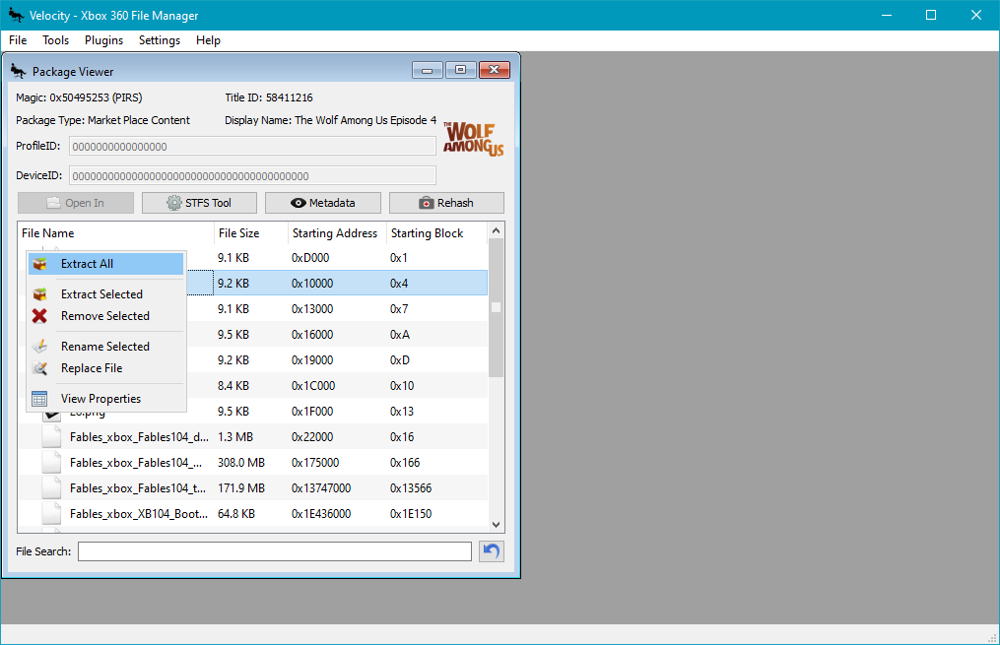

# How to install DLCs

1. Identify what the Game Title ID is.
This can be identified by running the game in Xenia.
	

2. Locate your DLC Content folder from your removable storage.
	

3. Download Velocity from [here](https://github.com/Gualdimar/Velocity/releases).

4. Open the Packages with Velocity.
	

5. Extract the content packages
	
to `Documents\Xenia\TitleID\00000002` and their corresponding folder names.
	

!!! note "Next section..."
	[Activating Games and DLCs](activate_games.md)
